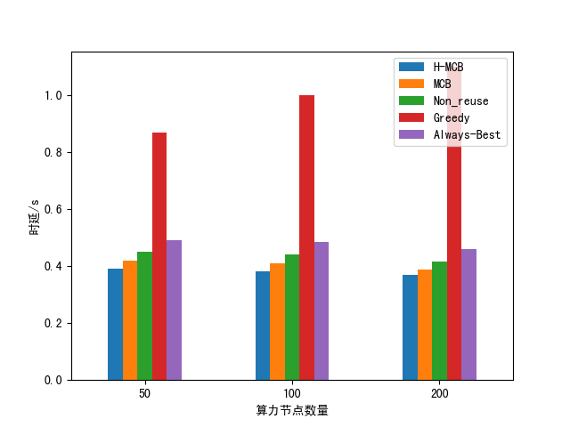
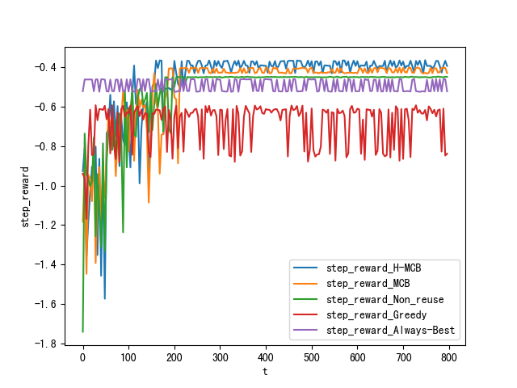
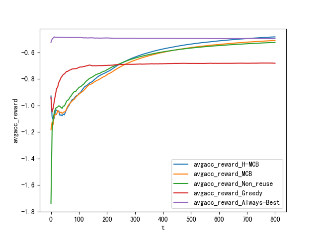

# 论文仿真
计算可重用的算力网络中时延敏感的任务调度优化/算力网络中基于资源重用的任务调度优化


## Quick Start

### 一、[安装simhei字体](https://blog.csdn.net/BIT_666/article/details/122365074)以显示中文

### 二、运行
```shell
#安装依赖
pip install -r requirements.txt

cd algorithms
python mctopm.py # 运行
```


## Preview







